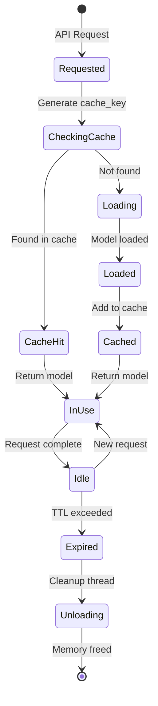
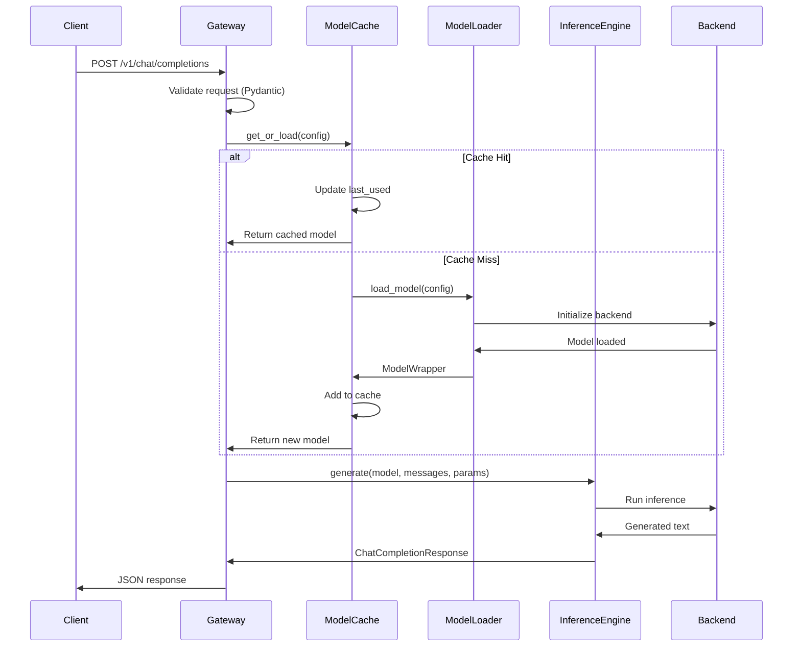
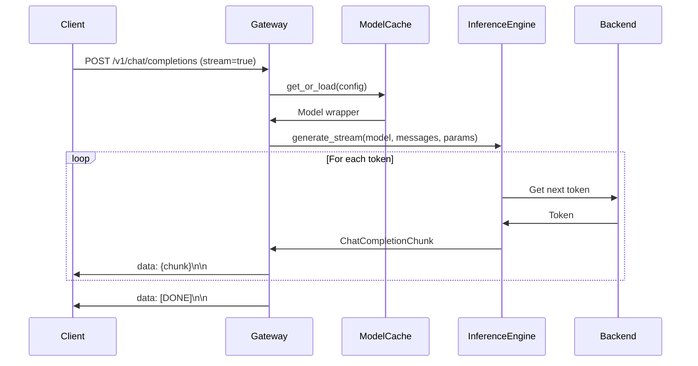
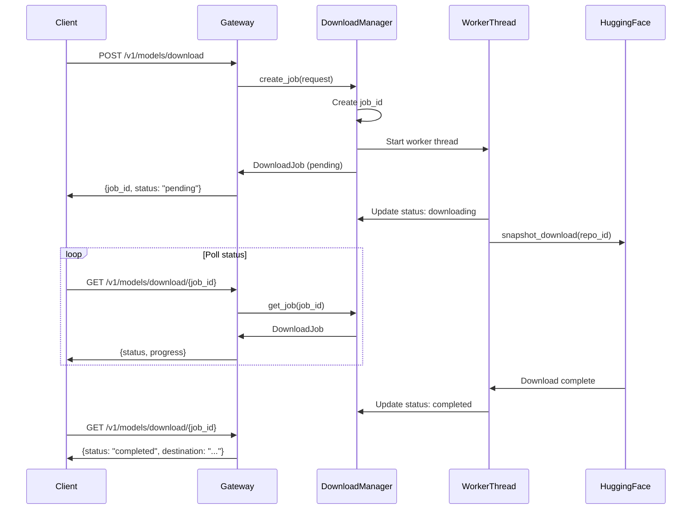

# Architecture Documentation

Comprehensive technical documentation of the Multi-LLM Server architecture, implementation details, and design decisions.

---

## Table of Contents

- [System Overview](#system-overview)
- [Core Components](#core-components)
- [Model Cache System](#model-cache-system)
- [Backend Engines](#backend-engines)
- [Request Flow](#request-flow)
- [Memory Management](#memory-management)
- [Download Manager](#download-manager)
- [Threading Model](#threading-model)
- [API Design](#api-design)
- [Error Handling](#error-handling)
- [Performance Considerations](#performance-considerations)
- [Design Decisions](#design-decisions)

---

## System Overview

The Multi-LLM Server is a **single-container inference server** that provides dynamic model loading capabilities across three different backend engines (vLLM, Transformers, llama.cpp) with intelligent caching and automatic memory management.

### Key Architectural Principles

1. **Zero Configuration** - No config files, all parameters specified per-request
2. **Dynamic Loading** - Models loaded on-demand and cached intelligently
3. **Exclusive Mode** - Same model path cannot exist with different configurations simultaneously
4. **Backend Agnostic** - Unified API regardless of backend engine
5. **Memory Aware** - Automatic TTL-based unloading and optional memory limits

### Technology Stack

- **FastAPI** - Web framework (async, high performance)
- **Python 3.10+** - Language runtime
- **vLLM** - GPU inference engine (optional)
- **Transformers** - HuggingFace models (CPU/GPU)
- **llama.cpp** - GGUF quantized models (CPU/GPU partial offload)
- **Docker** - Containerization
- **uvicorn** - ASGI server

---

## Core Components

### 1. FastAPI Gateway (`main.py`)

**Responsibilities:**
- HTTP request handling
- Request validation (Pydantic models)
- Routing to appropriate handlers
- Response formatting (JSON/SSE)
- Global exception handling

**Key Endpoints:**
- `/v1/chat/completions` - Chat completion (streaming/non-streaming)
- `/v1/models/*` - Model management (loaded, stats, inventory, unload)
- `/v1/models/download/*` - Download management

**Request Lifecycle:**
1. Request received and validated
2. ModelConfig created from parameters
3. Model retrieved from cache (or loaded)
4. Inference performed via InferenceEngine
5. Response formatted and returned

### 2. Model Cache (`model_cache.py`)

**Responsibilities:**
- In-memory model storage with TTL
- Thread-safe concurrent access
- Automatic expiration and cleanup
- Exclusive mode enforcement
- Cache statistics tracking

**Implementation Details:**

```python
class ModelCache:
    cache: OrderedDict[str, ModelCacheEntry]  # LRU cache
    locks: Dict[str, asyncio.Lock]             # Per-key locking
    global_lock: threading.RLock               # Global operations
    loader: ModelLoader                        # Model loading
    cleanup_thread: Thread                     # Background cleanup
```

**Cache Key Format:**
```
{model_path}_{backend}_{device}_{gpu_utilization}
```

Example: `/models/qwen-7b_llamacpp_cuda_0.7`

### 3. Model Loader (`model_loader.py`)

**Responsibilities:**
- Backend-specific model loading
- Model validation and error handling
- Memory estimation
- Model unloading and cleanup

**Backend Loading Logic:**
- **vLLM**: `LLM()` initialization with GPU memory config
- **Transformers**: `AutoModelForCausalLM` + `AutoTokenizer`
- **llama.cpp**: `Llama()` with GPU layer offloading

### 4. Inference Engine (`inference.py`)

**Responsibilities:**
- Backend-agnostic inference interface
- Message formatting (OpenAI → model-specific)
- Streaming implementation (SSE)
- Token generation with sampling parameters

**Inference Flow:**
```
messages → format_prompt() → backend.generate() → format_response()
```

### 5. Download Manager (`download_manager.py`)

**Responsibilities:**
- Background model downloads from HuggingFace
- Job tracking and status updates
- File filtering (quantization, patterns)
- Thread-safe job management

---

## Model Cache System

### Cache Architecture

The cache uses a **hybrid locking strategy** for optimal concurrency:

```
┌─────────────────────────────────────┐
│       Global RLock                  │
│  (for structural modifications)     │
└─────────────────────────────────────┘
            │
            ├─── Per-Key AsyncLock (cache_key_1)
            ├─── Per-Key AsyncLock (cache_key_2)
            └─── Per-Key AsyncLock (cache_key_3)
```

**Why This Design?**

- **Per-key locks** allow concurrent requests for different models
- **Global lock** protects cache structure modifications (add/remove entries)
- **AsyncLock** for async/await compatibility in FastAPI

### Cache Entry Lifecycle



### TTL Management

**TTL Calculation:**
- TTL starts from **last_used** timestamp (not loaded_at)
- Each request updates last_used (extending TTL)
- Expiration check: `now > last_used + ttl`

**Cleanup Thread:**
- Runs every `cleanup_interval` seconds (default: 30s)
- Scans all cache entries for expiration
- Unloads expired models sequentially
- Logs all cleanup actions

**TTL=0 Special Case:**
- TTL of 0 means "never expire"
- Model stays in cache until manually unloaded
- Useful for production long-running models

### Exclusive Mode

**Problem:** Same model with different configs causes conflicts (e.g., different GPU memory settings).

**Solution:** Exclusive mode automatically unloads conflicting configs.

**Algorithm:**
```python
def _unload_same_model_different_config(config):
    for cache_key, entry in cache:
        if entry.model_path == config.model and cache_key != new_cache_key:
            unload(cache_key)
```

**Example Scenario:**
1. Load `/models/qwen-7b` with `backend=llamacpp, device=cuda, n_gpu_layers=35`
2. Request `/models/qwen-7b` with `backend=llamacpp, device=cpu, n_gpu_layers=0`
3. System automatically unloads CUDA version before loading CPU version

### LRU Eviction

Cache uses `OrderedDict` with move-to-end on access:

```python
self.cache[cache_key]  # Access
self.cache.move_to_end(cache_key)  # Move to end (most recent)
```

When memory limits are reached, oldest (least recently used) models evicted first.

---

## Backend Engines

### vLLM Backend

**Characteristics:**
- GPU-only inference
- PagedAttention for efficient memory usage
- Fastest throughput for batch inference
- Best for production GPU workloads

**Configuration Parameters:**
```python
LLM(
    model=model_path,
    tensor_parallel_size=1,           # Multi-GPU support
    gpu_memory_utilization=0.7,       # GPU memory fraction
    trust_remote_code=True,           # Allow custom code
    dtype="auto"                      # FP16/BF16 auto-detect
)
```

**Streaming Implementation:**
```python
# vLLM generates all tokens, simulates streaming
for output in model.generate(prompt, sampling_params):
    yield output.text
```

### Transformers Backend

**Characteristics:**
- CPU and GPU support
- HuggingFace ecosystem compatibility
- Good for development and experimentation
- Moderate performance

**Configuration Parameters:**
```python
AutoModelForCausalLM.from_pretrained(
    model_path,
    torch_dtype=torch.float16,        # FP16 for GPU, FP32 for CPU
    device_map="auto",                # Auto device placement
    trust_remote_code=True,
    low_cpu_mem_usage=True            # Memory optimization
)
```

**Streaming Implementation:**
```python
# TextIteratorStreamer in background thread
streamer = TextIteratorStreamer(tokenizer, skip_prompt=True)
thread = Thread(target=model.generate, kwargs={..., "streamer": streamer})
thread.start()

for token in streamer:
    yield token
```

### llama.cpp Backend

**Characteristics:**
- GGUF quantized models
- Partial GPU offloading support
- Very memory efficient
- CPU and GPU mixed execution

**Configuration Parameters:**
```python
Llama(
    model_path=gguf_file,
    n_ctx=2048,                       # Context window size
    n_gpu_layers=-1,                  # -1 = all layers to GPU, 0 = CPU only
    verbose=False
)
```

**GPU Layer Offloading:**
- `n_gpu_layers=-1` → All layers on GPU (fastest)
- `n_gpu_layers=35` → 35 layers on GPU, rest on CPU (partial offload)
- `n_gpu_layers=0` → All layers on CPU (slowest, no GPU needed)

**Memory Usage Example (7B model, Q4_K_M quantization):**
- All GPU: ~4.2GB VRAM
- 35 layers GPU: ~3.0GB VRAM + 1.2GB RAM
- All CPU: ~4.2GB RAM

**Streaming Implementation:**
```python
# Native streaming support
stream = model(prompt, stream=True)
for chunk in stream:
    yield chunk['choices'][0]['text']
```

---

## Request Flow

### Non-Streaming Request Flow



### Streaming Request Flow



### Download Request Flow



---

## Memory Management

### GPU Memory Management

**vLLM GPU Memory:**
```python
gpu_memory_utilization = 0.7  # Use 70% of available VRAM

# vLLM allocates:
# - KV cache (most memory)
# - Model weights
# - Attention buffers
```

**Recommended Settings:**
- 0.9: Maximum performance, model must fit
- 0.7: Balanced (default)
- 0.5: Conservative, allows concurrent processes

**llama.cpp GPU Memory:**
```python
n_gpu_layers = 35  # Partial offloading

# Memory split:
# - GPU: Offloaded layers + KV cache
# - RAM: Remaining layers + context
```

**Estimation Formula (rough):**
```
GPU_Memory = (n_gpu_layers / total_layers) * model_size_gb * 1024
```

### Automatic Memory Cleanup

**Cleanup Triggers:**
1. **TTL expiration** - Periodic cleanup thread
2. **Manual unload** - API endpoint
3. **Exclusive mode** - Conflicting config loaded
4. **Memory limit** - LRU eviction (optional)

**Cleanup Process:**
```python
def unload_model(model_wrapper):
    # 1. Delete model objects
    del model_wrapper.model
    del model_wrapper.tokenizer  # If exists
    
    # 2. Force garbage collection
    gc.collect()
    
    # 3. Clear CUDA cache
    torch.cuda.empty_cache()
    torch.cuda.synchronize()
```

**Memory Reclamation:**
- Python GC reclaims heap memory
- CUDA cache cleared for GPU memory
- Synchronization ensures completion

### Memory Estimation

**Per-Backend Memory Estimation:**

```python
def estimate_model_memory(model_wrapper):
    if backend == VLLM:
        gpu_mb = torch.cuda.memory_allocated() / (1024**2)
    
    elif backend == TRANSFORMERS:
        if hasattr(model, 'get_memory_footprint'):
            total_mb = model.get_memory_footprint() / (1024**2)
        else:
            # Estimate from parameters
            params = sum(p.numel() for p in model.parameters())
            bytes_per_param = 2  # FP16
            total_mb = (params * bytes_per_param) / (1024**2)
    
    elif backend == LLAMACPP:
        # Estimate from file size
        file_size_mb = Path(model_path).stat().st_size / (1024**2)
```

---

## Download Manager

### Architecture

**Thread-Safe Job Tracking:**
```python
class DownloadManager:
    jobs: Dict[str, DownloadJob]           # All jobs
    active_workers: Dict[str, Thread]      # Running threads
    lock: threading.RLock                  # Thread safety
```

### Download Workflow

1. **Job Creation**
   - Generate unique job_id
   - Parse HuggingFace URL to repo_id
   - Determine destination directory
   - Create job record (status: pending)

2. **Worker Thread Launch**
   - Spawn daemon thread for download
   - Thread runs `_download_worker()`
   - Non-blocking, returns immediately

3. **Download Process**
   - Update status: downloading
   - Call `snapshot_download()` from huggingface_hub
   - Apply file filters (quantization, include/exclude)
   - Track progress (file count, duration)

4. **Completion**
   - Update status: completed/failed/cancelled
   - Record metadata (files_downloaded, duration_seconds)
   - Clean up worker thread reference

### File Filtering

**Quantization Filter:**
```python
if quantization:
    allow_patterns = [f"*{quantization}*.gguf"]
    # Example: "Q4_K_M" → ["*Q4_K_M*.gguf"]
```

**Custom Patterns:**
```python
include = ["*.gguf", "*.safetensors"]
exclude = ["*.bin", "*.pt"]
```

**HuggingFace Download:**
```python
snapshot_download(
    repo_id="org/model-name",
    local_dir="/models/model-name",
    allow_patterns=include,
    ignore_patterns=exclude,
    resume_download=True  # Resume if interrupted
)
```

### Job Status States

```
pending → downloading → completed
                    └─→ failed
                    └─→ cancelled
```

**Status Polling:**
- Client polls `GET /v1/models/download/{job_id}`
- Recommended interval: 5 seconds
- Job remains in memory until cleanup

---

## Threading Model

### Async/Await (FastAPI)

**FastAPI Async Model:**
- Event loop runs on main thread
- Async endpoints don't block event loop
- CPU-bound work moved to executor

**Executor Pattern:**
```python
# Model loading (CPU-bound) moved to thread pool
model = await asyncio.get_event_loop().run_in_executor(
    None,  # Default executor
    loader.load_model,
    config
)
```

### Background Threads

**1. Cleanup Thread (model_cache.py)**
```python
cleanup_thread = threading.Thread(
    target=self._cleanup_loop,
    daemon=True  # Dies with main process
)
```

**Responsibilities:**
- Periodic TTL expiration checks
- Model unloading
- Memory cleanup

**2. Download Workers (download_manager.py)**
```python
worker = threading.Thread(
    target=self._download_worker,
    args=(job_id, request),
    daemon=True,
    name=f"DownloadWorker-{job_id}"
)
```

**Responsibilities:**
- HuggingFace downloads
- Status updates
- Error handling

### Thread Safety

**Global Lock (RLock):**
```python
with self.global_lock:
    # Modify cache structure
    self.cache[key] = entry
```

**Per-Key Async Lock:**
```python
async with self.locks[cache_key]:
    # Load model for this cache_key
    model = load_model(config)
```

**Why Both?**
- Global lock: Protects OrderedDict structure
- Per-key lock: Prevents duplicate loading of same model

---

## API Design

### OpenAI Compatibility

**Design Goal:** Drop-in replacement for OpenAI Chat API.

**Request Format:**
```json
{
  "model": "/models/qwen-7b",        // Path instead of name
  "backend": "llamacpp",             // Extra: backend selection
  "device": "cuda",                  // Extra: device selection
  "messages": [...],                 // OpenAI standard
  "max_tokens": 512,                 // OpenAI standard
  "temperature": 0.7,                // OpenAI standard
  "stream": false                    // OpenAI standard
}
```

**Response Format (Non-streaming):**
```json
{
  "id": "chatcmpl-123",
  "object": "chat.completion",
  "created": 1234567890,
  "model": "/models/qwen-7b",
  "choices": [{
    "index": 0,
    "message": {
      "role": "assistant",
      "content": "Response text"
    },
    "finish_reason": "stop"
  }],
  "usage": {
    "prompt_tokens": 25,
    "completion_tokens": 48,
    "total_tokens": 73
  }
}
```

**Response Format (Streaming):**
```
data: {"id":"chatcmpl-123","choices":[{"delta":{"role":"assistant"}}]}

data: {"id":"chatcmpl-123","choices":[{"delta":{"content":"Hello"}}]}

data: [DONE]
```

### Pydantic Validation

**Request Models:**
```python
class ChatCompletionRequest(BaseModel):
    model: str
    backend: BackendType  # Enum: vllm, transformers, llamacpp
    device: DeviceType    # Enum: cuda, cpu
    messages: List[ChatMessage]
    stream: bool = False
    max_tokens: int = 512
    temperature: float = 0.7
    # ... additional fields
```

**Benefits:**
- Automatic validation
- Type safety
- Auto-generated OpenAPI schema
- Clear error messages

### Error Responses

**Standard Error Format:**
```json
{
  "error": {
    "message": "Model not found: /models/invalid",
    "type": "not_found_error",
    "details": "..."
  }
}
```

**HTTP Status Codes:**
- 200: Success
- 400: Invalid request (validation error)
- 404: Model not found
- 500: Internal server error (model loading failed, OOM, etc.)

---

## Error Handling

### Error Categories

**1. Validation Errors (400)**
```python
# Missing required field
{"model": "/models/test"}  # Missing backend, device
→ 400: "Field 'backend' is required"

# Invalid enum value
{"backend": "invalid"}
→ 400: "Invalid backend: must be vllm, transformers, or llamacpp"
```

**2. Resource Errors (404)**
```python
# Model not found
{"model": "/models/nonexistent"}
→ 404: "Model path does not exist: /models/nonexistent"

# Download job not found
GET /v1/models/download/invalid_id
→ 404: "Download job not found: invalid_id"
```

**3. Runtime Errors (500)**
```python
# CUDA OOM
→ 500: "CUDA out of memory"

# Backend import error
→ 500: "vLLM is not installed"

# Model loading failure
→ 500: "Model loading failed: ..."
```

### Error Handling Strategy

**Layered Error Handling:**

```
Request
  ↓
Pydantic Validation (400)
  ↓
Business Logic (404, 500)
  ↓
Global Exception Handler (500)
  ↓
Response
```

**Global Exception Handler:**
```python
@app.exception_handler(Exception)
async def global_exception_handler(request, exc):
    logger.error(f"Unhandled exception: {exc}", exc_info=True)
    return JSONResponse(
        status_code=500,
        content={"error": {"message": "Internal server error"}}
    )
```

**Graceful Degradation:**
- Log all errors with full context
- Return helpful error messages
- Don't expose internal details in production
- Clean up resources on error (model unloading)

---

## Performance Considerations

### Concurrency

**Concurrent Request Handling:**
- FastAPI handles multiple requests concurrently
- Per-key locks prevent duplicate model loading
- Different models can load simultaneously

**Bottlenecks:**
- Model loading (disk I/O, memory allocation)
- Inference (CPU/GPU compute)
- Memory constraints (cache size)

### Caching Strategy

**Cache Hit Optimization:**
- Use consistent cache keys
- Reasonable TTL values (300-3600s)
- Monitor hit rate via `/v1/models/stats`

**Cache Miss Mitigation:**
- Pre-load frequently used models
- Use longer TTLs for production models
- Consider TTL=0 for always-loaded models

### Memory Optimization

**Tips for Large Models:**
1. Use GGUF quantization (4-bit, 5-bit)
2. Use partial GPU offloading (llama.cpp)
3. Reduce GPU memory utilization (vLLM)
4. Use CPU backend for less critical workloads

**Memory Footprint Examples (7B model):**
- FP16: ~14GB
- Q4_K_M (GGUF): ~4GB
- Q5_K_M (GGUF): ~5GB

### Inference Performance

**Factors Affecting Latency:**
- Backend choice (vLLM > llama.cpp > Transformers)
- Device (GPU > CPU)
- Model size (7B > 13B > 70B)
- Quantization (Lower bits = faster)
- Context length (Longer = slower)
- Batch size (vLLM batching helps)

**Optimization Tips:**
- Use vLLM for production GPU workloads
- Use appropriate quantization levels
- Limit max_tokens to reasonable values
- Enable streaming for better perceived latency

---

## Design Decisions

### Why No Configuration Files?

**Decision:** All configuration via API parameters.

**Rationale:**
- Eliminates restart requirements
- Supports dynamic use cases
- Easier to containerize
- Better for multi-tenant scenarios
- Simpler deployment

### Why Exclusive Mode?

**Decision:** Same model can't run with different configs.

**Rationale:**
- Prevents resource conflicts
- Simplifies memory management
- Avoids confusing behavior
- Explicit model control

**Alternative Considered:**
- Allow multiple configs, use model_path + config in cache key
- Rejected: Too much memory usage, unclear which config to use

### Why Three Backends?

**Decision:** Support vLLM, Transformers, and llama.cpp.

**Rationale:**
- **vLLM**: Best GPU performance, production workloads
- **Transformers**: Universal compatibility, development
- **llama.cpp**: GGUF support, memory efficiency

**Alternative Considered:**
- Single backend (e.g., just vLLM)
- Rejected: Limited flexibility, GPU-only

### Why TTL-Based Expiration?

**Decision:** Automatic unloading based on time-to-live.

**Rationale:**
- Automatic memory management
- No manual intervention needed
- Prevents memory leaks
- Configurable per-request

**Alternative Considered:**
- LRU eviction only (no TTL)
- Rejected: Doesn't guarantee timely cleanup

### Why Background Download?

**Decision:** Non-blocking downloads with job tracking.

**Rationale:**
- Large models take minutes/hours
- Client shouldn't block
- Can monitor progress
- Can cancel if needed

**Alternative Considered:**
- Synchronous download
- Rejected: Timeouts, poor UX

---

## Future Enhancements

### Potential Improvements

1. **Request Queuing**
   - Queue system for concurrent requests
   - Priority queues for different model tiers
   - Rate limiting per model

2. **Metrics & Monitoring**
   - Prometheus metrics endpoint
   - Inference latency tracking
   - Cache hit rate monitoring
   - Memory usage tracking

3. **Multi-GPU Support**
   - Model sharding across GPUs
   - GPU pool management
   - Load balancing

4. **Advanced Caching**
   - Persistent cache (disk storage)
   - Distributed cache (Redis)
   - Smart pre-loading

5. **Authentication & Authorization**
   - API key management
   - Per-user quotas
   - Model access control

6. **Model Registry**
   - Database-backed model catalog
   - Metadata storage
   - Version tracking

---

## Conclusion

The Multi-LLM Server architecture prioritizes **flexibility**, **simplicity**, and **performance** through:

- Dynamic model loading without configuration files
- Intelligent caching with automatic memory management
- Multi-backend support for different use cases
- OpenAI-compatible API for easy integration
- Single-container deployment for operational simplicity

This architecture supports both development experimentation and production deployment with minimal operational overhead.

---

**For implementation details, see the source code in `gateway/` directory.**

**For usage examples, see [EXAMPLES.md](EXAMPLES.md).**

**For contribution guidelines, see [CONTRIBUTING.md](CONTRIBUTING.md).**
