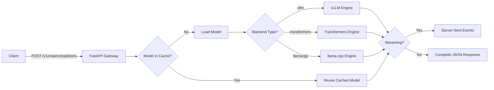

# Dynamic Multi-Backend LLM Inference Server


**Production-ready LLM inference server with dynamic model loading, intelligent caching, streaming support, and OpenAI-compatible API.**

Supports multiple backends (vLLM, Transformers, llama.cpp), automatic model management with TTL-based unloading, and zero-configuration model switching, all controlled via API parameters.

---

## Why This Exists

This project was born out of frustration with existing LLM inference solutions:

**The Problem:**
- **Ollama's slow model loading** - Every model switch meant waiting minutes for models to load, killing productivity during development and experimentation
- **Single backend limitations** - Existing solutions force you to choose one backend, but different formats have different strengths:
  - GGUF quantized models for memory efficiency
  - SafeTensors for production GPU inference
  - Different quantization levels for different use cases
- **Installation overhead** - Want to try a new model format? Install another entire backend system, configure it, manage dependencies...

**The Solution:**

This server gives you **all backends in one place** with **instant model switching**. Load a GGUF model with llama.cpp, switch to a SafeTensors model with vLLM, then try a CPU model with Transformers, all through the same API, no restarts, no configuration files.

**Key insight:** Model caching + dynamic loading means the first load is slow, but subsequent requests are instant. Combined with TTL-based management, you get the flexibility of Ollama with the performance of dedicated backends.

---

## Features

### Core Capabilities

- **Dynamic Model Loading** - Load any model on-demand via API request, no configuration files needed
- **Intelligent Caching** - Automatic TTL-based model unloading with configurable cache lifetime
- **Three Backend Engines**
  - **vLLM** - High-performance GPU inference with PagedAttention
  - **Transformers** - Flexible CPU/GPU inference with HuggingFace models
  - **llama.cpp** - Efficient GGUF model support with partial GPU offloading
- **Streaming Support** - Server-Sent Events (SSE) streaming for real-time responses
- **Built-in Model Downloader** - Download models from HuggingFace directly via API
- **Model Inventory** - Automatic discovery of downloaded models
- **OpenAI Compatible** - Drop-in replacement for OpenAI Chat Completions API
- **Docker Ready** - Single-container deployment with Docker Compose

### Technical Highlights

- **Per-Request Configuration** - Specify model, backend, device, and parameters per API call
- **Exclusive Mode** - Same model path with different configs (e.g., CPU and GPU instances)
- **Memory Management** - Configurable GPU memory utilization and automatic cleanup
- **Zero Configuration** - No YAML files or code changes to use new models
- **RESTful Management** - Full API for cache inspection, model unloading, and statistics

---

## Comparison with Alternatives

Comparison with popular alternatives:

| Feature | This Project | vLLM Standalone | Ollama | text-generation-inference |
|---------|-------------|-----------------|--------|---------------------------|
| **Multi-backend** | Yes (vLLM + Transformers + llama.cpp) | No (vLLM only) | No (Custom engine) | No (TGI only) |
| **Dynamic Loading** | Yes (Load on-demand) | No (Static config) | Yes | No (Static config) |
| **GGUF Support** | Yes (Via llama.cpp) | No | Yes | No |
| **OpenAI API** | Yes (Full compatibility) | Partial | Partial (Custom format) | Partial |
| **Streaming** | Yes (SSE streaming) | Yes | Yes | Yes |
| **CPU Support** | Yes (Transformers backend) | No (GPU only) | Yes | Limited |
| **Built-in Downloader** | Yes (HF integration) | No (Manual) | No (Manual) | No (Manual) |
| **Deployment** | Single container | Multi-container | Binary | Multi-container |

**Best for**: Development environments, multi-model experimentation, mixed GPU/CPU setups, GGUF quantized models.

---

## Architecture



**Key Components:**

1. **FastAPI Gateway** - Single entry point for all requests
2. **Model Cache** - In-memory cache with TTL-based lifecycle management
3. **Backend Engines** - Swappable inference engines selected per-request
4. **Download Manager** - Background HuggingFace download orchestration

---

## Quick Start

### Prerequisites

- **Docker** and **Docker Compose** installed
- **NVIDIA GPU** with CUDA support (optional for CPU-only usage)
- **NVIDIA Container Toolkit** (for GPU support)

### Installation

```bash
git clone https://github.com/yourusername/multi-llm-server.git
cd multi-llm-server
docker compose up -d
```

The server will start on `http://localhost:8080`.

### Download a Model

Use the built-in download manager to fetch models from HuggingFace:

```bash
curl -X POST http://localhost:8080/v1/models/download \
  -H "Content-Type: application/json" \
  -d '{
    "url": "https://huggingface.co/Qwen/Qwen2.5-Coder-7B-Instruct-GGUF",
    "quantization": "Q4_K_M"
  }'
```

**Response:**
```json
{
  "job_id": "download_1707689234567",
  "status": "downloading",
  "destination": "/models/qwen2.5-coder-7b-instruct-gguf",
  "message": "Downloading model files..."
}
```

Check download status:

```bash
curl http://localhost:8080/v1/models/download/download_1707689234567
```

### Make Your First Request

**Non-streaming (complete response):**

```bash
curl -X POST http://localhost:8080/v1/chat/completions \
  -H "Content-Type: application/json" \
  -d '{
    "model": "/models/qwen2.5-coder-7b-instruct-gguf",
    "backend": "llamacpp",
    "device": "cuda",
    "n_gpu_layers": 35,
    "messages": [
      {"role": "system", "content": "You are a helpful coding assistant."},
      {"role": "user", "content": "Write a Python function to calculate factorial"}
    ],
    "max_tokens": 500,
    "temperature": 0.7
  }'
```

**Streaming (real-time response):**

```bash
curl -X POST http://localhost:8080/v1/chat/completions \
  -H "Content-Type: application/json" \
  -d '{
    "model": "/models/qwen2.5-coder-7b-instruct-gguf",
    "backend": "llamacpp",
    "device": "cuda",
    "stream": true,
    "messages": [{"role": "user", "content": "Explain Docker in simple terms"}],
    "max_tokens": 200
  }'
```

**vLLM with Qwen3-Coder (using max_model_len for mrope models):**

```bash
curl -X POST http://localhost:8080/v1/chat/completions \
  -H "Content-Type: application/json" \
  -d '{
    "model": "/models/qwen3-coder-30b",
    "backend": "vllm",
    "device": "cuda",
    "gpu_memory_utilization": 0.9,
    "max_model_len": 32000,
    "messages": [
      {"role": "system", "content": "You are an expert programmer."},
      {"role": "user", "content": "Write a function to reverse a string"}
    ],
    "max_tokens": 500,
    "temperature": 0.7
  }'
```

---

## API Reference

### `POST /v1/chat/completions`

OpenAI-compatible chat completions endpoint with dynamic model loading.

**Request Body:**

```json
{
  "model": "/models/model-directory",
  "backend": "vllm|transformers|llamacpp",
  "device": "cuda|cpu",
  "messages": [
    {"role": "system", "content": "System prompt"},
    {"role": "user", "content": "User message"}
  ],
  "stream": false,
  "max_tokens": 512,
  "temperature": 0.7,
  "top_p": 1.0,
  "gpu_memory_utilization": 0.7,
  "ttl": 300,
  "n_gpu_layers": -1,
  "n_ctx": 2048
}
```

**Parameters:**

| Parameter | Type | Required | Default | Description |
|-----------|------|----------|---------|-------------|
| `model` | string | Required | - | Path to model directory (e.g., `/models/llama-7b`) |
| `backend` | string | Required | - | Inference backend: `vllm`, `transformers`, or `llamacpp` |
| `device` | string | Required | - | Device: `cuda` or `cpu` |
| `messages` | array | Required | - | Chat messages in OpenAI format |
| `stream` | boolean | Optional | false | Enable SSE streaming |
| `max_tokens` | integer | Optional | 512 | Maximum tokens to generate |
| `temperature` | float | Optional | 0.7 | Sampling temperature (0.0-2.0) |
| `top_p` | float | Optional | 1.0 | Nucleus sampling threshold |
| `gpu_memory_utilization` | float | Optional | 0.7 | GPU memory utilization (0.1-1.0, vLLM only) |
| `ttl` | integer | Optional | 300 | Model cache TTL in seconds |
| `n_gpu_layers` | integer | Optional | -1 | GPU layers to offload (llama.cpp only, -1 = all) |
| `n_ctx` | integer | Optional | 2048 | Context window size (llama.cpp only) |
| `max_model_len` | integer | Optional | None | Maximum context length (vLLM only, bypasses rope_scaling validation) |

**Response (Non-streaming):**

```json
{
  "id": "chatcmpl-1707689234567",
  "object": "chat.completion",
  "created": 1707689234,
  "model": "/models/qwen2.5-coder-7b-instruct-gguf",
  "choices": [
    {
      "index": 0,
      "message": {
        "role": "assistant",
        "content": "Here's a Python factorial function:\n\ndef factorial(n):\n    if n <= 1:\n        return 1\n    return n * factorial(n-1)"
      },
      "finish_reason": "stop"
    }
  ],
  "usage": {
    "prompt_tokens": 25,
    "completion_tokens": 48,
    "total_tokens": 73
  }
}
```

**Response (Streaming):**

Server-Sent Events format:

```
data: {"id":"chatcmpl-123","choices":[{"index":0,"delta":{"role":"assistant"},"finish_reason":null}]}

data: {"id":"chatcmpl-123","choices":[{"index":0,"delta":{"content":"Here's"},"finish_reason":null}]}

data: {"id":"chatcmpl-123","choices":[{"index":0,"delta":{"content":" a"},"finish_reason":null}]}

data: [DONE]
```

---

### Model Management Endpoints

#### `GET /v1/models/loaded`

List currently loaded models in cache.

**Response:**
```json
{
  "loaded_models": [
    {
      "cache_key": "qwen2.5-coder-7b-instruct-gguf_llamacpp_cuda",
      "model_path": "/models/qwen2.5-coder-7b-instruct-gguf",
      "backend": "llamacpp",
      "device": "cuda",
      "loaded_at": "2026-02-11T10:30:00",
      "ttl": 300,
      "expires_at": "2026-02-11T10:35:00"
    }
  ],
  "total_count": 1
}
```

#### `GET /v1/models/stats`

Get cache statistics and memory usage.

**Response:**
```json
{
  "total_models": 1,
  "active_models": 1,
  "total_requests": 42,
  "cache_hits": 38,
  "cache_misses": 4,
  "hit_rate": 0.905
}
```

#### `GET /v1/models/inventory`

List all downloaded models in `/models/` directory.

**Response:**
```json
{
  "models": [
    {
      "name": "qwen2.5-coder-7b-instruct-gguf",
      "path": "/models/qwen2.5-coder-7b-instruct-gguf",
      "size_gb": 4.2,
      "files": [
        {"name": "model-Q4_K_M.gguf", "size_mb": 4200, "type": "gguf"}
      ],
      "recommended_backends": ["llamacpp"]
    }
  ],
  "total_models": 1,
  "total_size_gb": 4.2
}
```

#### `POST /v1/models/unload`

Manually unload a specific model from cache.

**Request:**
```json
{
  "model": "/models/qwen2.5-coder-7b-instruct-gguf",
  "backend": "llamacpp",
  "device": "cuda"
}
```

#### `POST /v1/models/unload-all`

Unload all models from cache (free memory).

---

### Download Endpoints

#### `POST /v1/models/download`

Start background download from HuggingFace.

**Request:**
```json
{
  "url": "https://huggingface.co/org/model-name",
  "destination": "custom-name",
  "quantization": "Q4_K_M",
  "include": ["*.gguf"],
  "exclude": ["*.bin"]
}
```

**Parameters:**

- `url` (required) - HuggingFace repository URL
- `destination` (optional) - Custom directory name in `/models/`
- `quantization` (optional) - GGUF quantization filter (e.g., `Q4_K_M`, `IQ4_XS`)
- `include` (optional) - File patterns to include
- `exclude` (optional) - File patterns to exclude

#### `GET /v1/models/download/{job_id}`

Check download job status.

#### `GET /v1/models/download`

List all download jobs.

#### `DELETE /v1/models/download/{job_id}`

Cancel a running download.

#### `POST /v1/models/verify-repo`

Verify HuggingFace repository accessibility before downloading.

---

## Backend Comparison

| Backend | Best For | GPU Required | GGUF Support | Speed | Memory Efficiency | Quantization |
|---------|----------|--------------|--------------|-------|-------------------|--------------|
| **vLLM** | Production GPU inference | Yes | No | Fastest | High (PagedAttention) | FP16, BF16 |
| **Transformers** | Development, CPU inference | Optional | No | Moderate | Moderate | FP32, FP16, INT8 |
| **llama.cpp** | GGUF models, partial GPU | Optional | Yes | Fast | Very High | All GGUF quants |

**Recommendation Guide:**

- **Use vLLM** for: Production GPU workloads, maximum throughput, serving popular HF models
- **Use Transformers** for: Development, CPU-only environments, custom model architectures
- **Use llama.cpp** for: GGUF quantized models, partial GPU offloading (large models), maximum memory efficiency

---

## Configuration & Performance Tuning

### GPU Memory Utilization (vLLM)

Controls GPU memory allocation:

- `0.9` - Aggressive (best performance, model must fit in VRAM)
- `0.7` - Balanced (recommended default)
- `0.5` - Conservative (allows room for other processes)

### GPU Layer Offloading (llama.cpp)

Use `n_gpu_layers` to control partial GPU offloading:

```bash
# Full GPU (fastest)
"n_gpu_layers": -1

# Partial offload (35 layers to GPU, rest to RAM)
"n_gpu_layers": 35

# CPU only
"n_gpu_layers": 0
```

### TTL Configuration

Adjust model cache lifetime:

```bash
# Short TTL (5 minutes) - frequent model switching
"ttl": 300

# Long TTL (1 hour) - stable workload
"ttl": 3600

# Persistent (effectively disable auto-unload)
"ttl": 86400
```

### Environment Variables

Set in `docker-compose.yml`:

```yaml
environment:
  - DEFAULT_TTL=300          # Default model cache TTL (seconds)
  - CLEANUP_INTERVAL=30      # Cache cleanup check interval (seconds)
  - PORT=8080                # Server port
  - HOST=0.0.0.0            # Bind address
```

---

## Examples

See [EXAMPLES.md](EXAMPLES.md) for comprehensive examples including:

- Python client with streaming
- Node.js/JavaScript integration
- Multi-model workflows
- Error handling patterns
- Production deployment examples

---

## Troubleshooting

### Model Download Failures

**Issue:** Download times out or fails

**Solutions:**
- Check network connectivity to HuggingFace
- Verify repository URL is correct and public
- Use `/v1/models/verify-repo` endpoint to test before downloading
- Check disk space in `/models/` directory

### CUDA Out of Memory

**Issue:** `RuntimeError: CUDA out of memory`

**Solutions:**
- Reduce `gpu_memory_utilization` (try 0.5 or 0.3)
- Use smaller model or quantized version
- Use llama.cpp with `n_gpu_layers` for partial offloading
- Switch to CPU with `"device": "cpu"` and `"backend": "transformers"`
- Unload unused models: `POST /v1/models/unload-all`

### Model Not Found

**Issue:** `FileNotFoundError: Model not found at /models/...`

**Solutions:**
- Verify model path with `GET /v1/models/inventory`
- Ensure download completed: `GET /v1/models/download/{job_id}`
- Check file permissions in `/models/` directory
- Verify Docker volume mount is correct

### Streaming Connection Issues

**Issue:** Streaming response hangs or times out

**Solutions:**
- Ensure client supports Server-Sent Events (SSE)
- Check for proxy/load balancer buffering (add `X-Accel-Buffering: no` header)
- Increase client timeout settings
- Test with curl to isolate client-side issues

### Backend Import Errors

**Issue:** `ModuleNotFoundError: No module named 'vllm'`

**Solutions:**
- Ensure correct backend for your setup (vLLM requires GPU, Transformers works on CPU)
- Rebuild Docker image: `docker compose build --no-cache`
- Check gateway container logs: `docker compose logs gateway`

### vLLM rope_scaling AssertionError

**Issue:** `AssertionError: assert "factor" in rope_scaling` when loading Qwen3-Coder or similar models

**Cause:** Some models (Qwen3, Phi-3) use mrope (multi-resolution RoPE) scaling without a "factor" field, which vLLM's validation expects.

**Solution:** Use the `max_model_len` parameter to bypass rope_scaling validation:

```bash
curl -X POST http://localhost:8080/v1/chat/completions \
  -H "Content-Type: application/json" \
  -d '{
    "model": "/models/qwen3-coder-30b",
    "backend": "vllm",
    "device": "cuda",
    "max_model_len": 32000,
    "messages": [{"role": "user", "content": "Hello"}],
    "max_tokens": 100
  }'
```

**Recommended values for max_model_len:**
- Qwen3-Coder-30B: 32000
- Phi-3: 4096 or 128000 (depending on variant)
- When unsure, check model's `config.json` for `max_position_embeddings`

---

## Architecture Deep Dive

For detailed technical documentation, see [ARCHITECTURE.md](ARCHITECTURE.md).

Topics covered:
- Model cache implementation and lifecycle
- Backend selection and loading logic
- Memory management strategies
- Download manager internals
- Request flow and error handling

---

## Contributing

Contributions are welcome! Please see [CONTRIBUTING.md](CONTRIBUTING.md) for guidelines.

### Quick Links

- [Report a Bug](https://github.com/yourusername/multi-llm-server/issues/new?template=bug_report.md)
- [Request a Feature](https://github.com/yourusername/multi-llm-server/issues/new?template=feature_request.md)
- [Submit a Pull Request](https://github.com/yourusername/multi-llm-server/pulls)

---

## Project Structure

```
multi-llm-server/
├── gateway/
│   ├── main.py                 # FastAPI application and endpoints
│   ├── inference.py            # Inference engine (vLLM, Transformers, llama.cpp)
│   ├── model_cache.py          # Model cache with TTL management
│   ├── model_loader.py         # Backend-specific model loading
│   ├── model_scanner.py        # Model inventory discovery
│   ├── download_manager.py     # HuggingFace download orchestration
│   ├── models.py               # Pydantic data models
│   ├── requirements.txt        # Python dependencies
│   └── Dockerfile              # Gateway container image
├── docker-compose.yml          # Service orchestration
├── models/                     # Model storage (Docker volume)
├── README.md                   # This file
├── LICENSE                     # MIT License
├── CONTRIBUTING.md             # Contribution guidelines
├── EXAMPLES.md                 # Code examples
└── ARCHITECTURE.md             # Technical documentation
```

---

## License

This project is licensed under the MIT License - see the [LICENSE](LICENSE) file for details.


## Support

- **Issues**: [GitHub Issues](https://github.com/yourusername/multi-llm-server/issues)
- **Discussions**: [GitHub Discussions](https://github.com/yourusername/multi-llm-server/discussions)
- **Documentation**: [Wiki](https://github.com/yourusername/multi-llm-server/wiki)

---

**Built for the LLM community**
